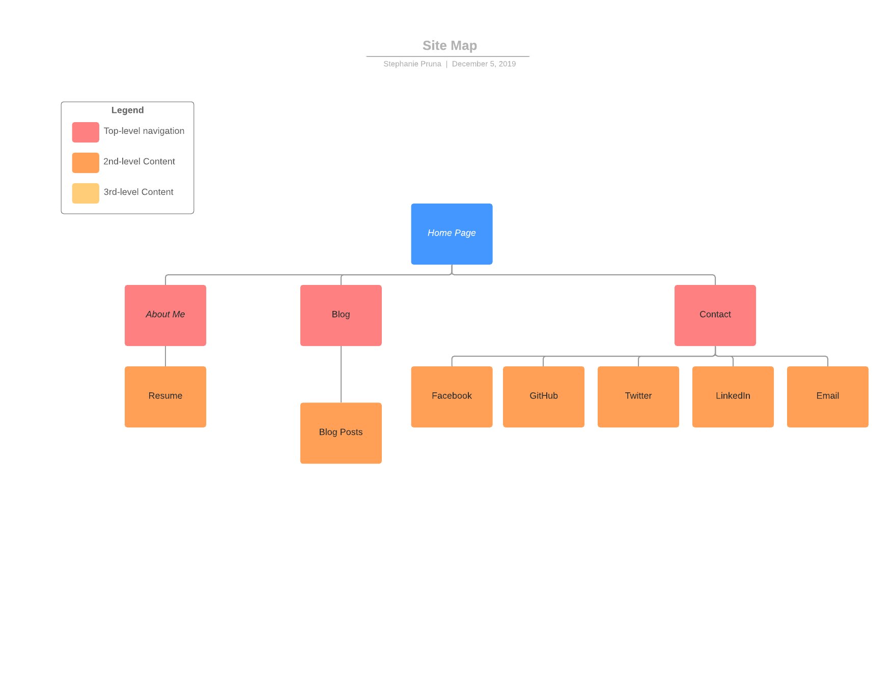

# Portfolio-assignment

### Website Link:
https://steph-portfolio.netlify.com 

### GitHub Repo Link:
https://github.com/Victoriablu/portfolio-assignment

### Purpose:
A website that shows my professional portfolio including:
1. Home - Welcome message and navigation Links
2. About Me - Profile photo, information about me, link to resume, education list and skills list.
3. Blog -  Links to blog posts with pictures and publish dates.
4. Contact - All my contact details including Facebook, LinkedIn, Twitter and Email.

### Functionality
All pages are accessed via a navigation bar at the top which is on each page. All links to external sites open in a new tab. Blog links open to selected content on blog post page. 

### Features
1. Navigation Bar
2. Link to Resume
3. Blog links with pictures in flex box layout
4. Social Media links with icons
5. Background Image on each page

### SiteMap

### Screenshots

### Target Audience
Potential employers, recruitement agencies and clients wishing to view my profile. 

### Tech Stack
1. HTML5
2. CSS
3. Netlify (Deployment)
4. Canva (Design and Images)